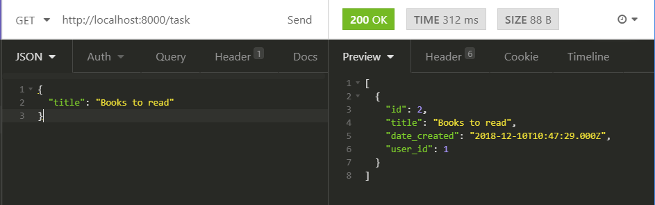
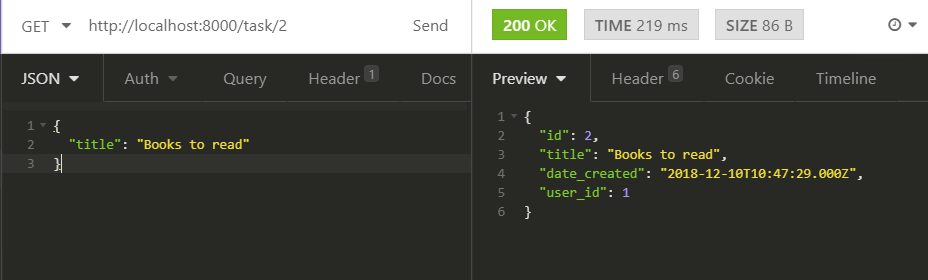
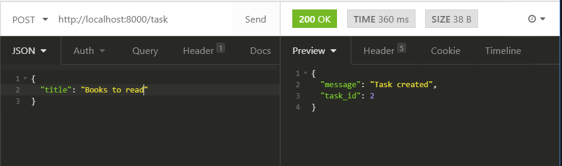
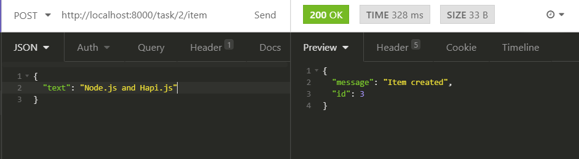
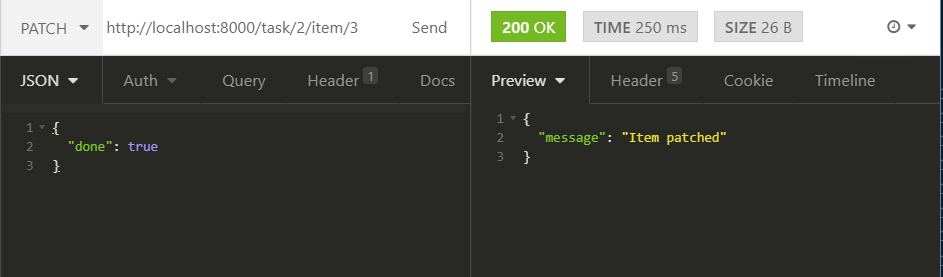
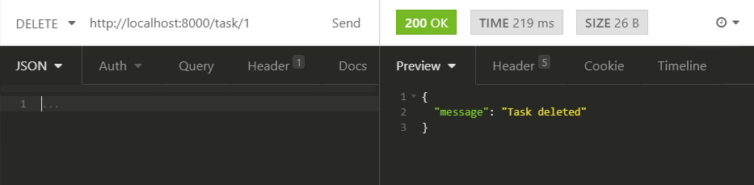

# hapi-server

Creating basic Node.js server with Hapi framework

This is an app where client can perform CRUD operations on backend.

## Routes exist on API...:

GET
http://localhost:8000/

--
GET
http://localhost:8000/task

## 

GET a specific task
http://localhost:8000/task/1/item id: should be an integer number.

## 

POST
http://localhost:8000/task

## 

POST
http://localhost:8000/task/id/item

## 

PATCH
http://localhost:8000/task/id id: should be an integer number.

--
PATCH
http://localhost:8000/task/id/item/id id: should be an integer number.
--

DELETE
http://localhost:8000/task/id id: should be an integer number.

## 

DELETE
http://localhost:8000/task/id/item/id id: should be an integer number.
